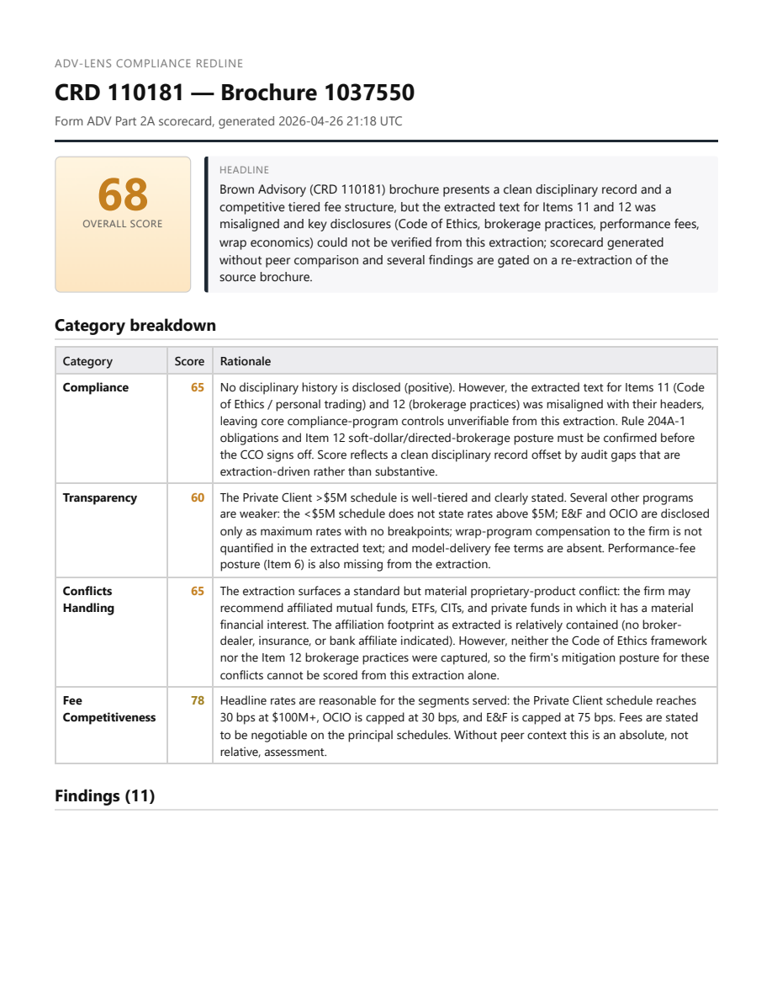
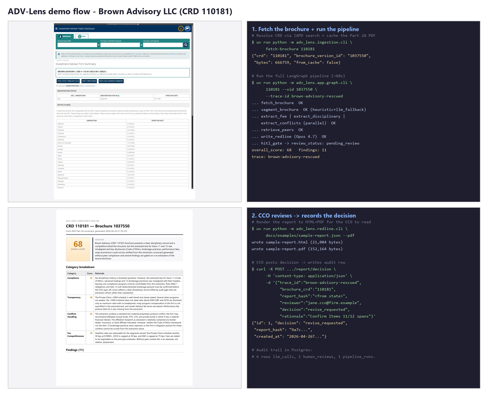

# ADV-Lens

> Form ADV Part 2A intelligence + peer benchmarking. A LangGraph agent that
> ingests any RIA's Form ADV Part 2A brochure and produces a
> compliance-and-competitive scorecard: fee-structure benchmarking vs peer
> advisers, disciplinary disclosure flags, conflict-of-interest enumeration,
> and a redline against SEC plain-English expectations.

**Status:** Pipeline feature-complete end-to-end on real SEC filings.
First live IAPD run landed against Brown Advisory LLC (CRD 110181) on
2026-04-26, sample at [`docs/examples/sample-report.json`](docs/examples/sample-report.json)
([HTML](docs/examples/sample-report.html) /
[PDF](docs/examples/sample-report.pdf)). Eval harness at **17/19 pass,
mean F1 0.921** on the 19-fixture golden set after the Day-14g scorer
fixes. The full operator reference is in [`docs/user-manual.pdf`](docs/user-manual.pdf)
(26 pages, includes the Brown Advisory Item 5 + Item 9 + IAPD-search
screenshots).

---

## The problem

RIA Chief Compliance Officers spend ~40 hours a year reading peer brochures to
defend their own annual ADV review. M&A diligence teams at RIA aggregators do
the same work on every target firm. Both are paralegal-grade reads that
should be machine-assisted.

Neither audience wants a chatbot. They want a structured scorecard they can
defend on exam or in a deal memo.

## Who this is for

1. A **hiring manager** at F2 Strategy or a peer consultancy evaluating
   whether Robert Colling can ship production AI for wealth management.
2. An **RIA Chief Compliance Officer** who wants to trust the outputs,
   inspect the Langfuse trace, and re-run the eval harness quarterly.
3. A **senior engineer** evaluating the code for hire. Architecture, eval
   discipline, structured-output contracts, HITL design.

## Sample output

The first live IAPD run produced this CCO-readable redline for Brown
Advisory LLC (CRD 110181):



Full artifact: [HTML](docs/examples/sample-report.html) · [PDF](docs/examples/sample-report.pdf) · [JSON](docs/examples/sample-report.json).

## Reviewer UI

A thin server-rendered review surface ships with the app at
[`/review`](docs/adr/0016-review-ui.md). It lists pipeline runs, opens
each one as a side-by-side redline + decision form, and writes the same
``human_reviews`` row the JSON `POST /report/decision` would — so the
audit semantics carry through unchanged.

```bash
docker compose up -d postgres qdrant
uv run python -m adv_lens.app.web.seed   # one-shot: load Brown Advisory sample
uv run uvicorn adv_lens.app.main:app --reload
# → http://localhost:8000/review
```

The redline body is reused verbatim from `render_redline_html`
(iframed) so the bytes a CCO sees in the browser are the same bytes
the email/PDF path produces. Decision form posts via HTMX → the
decisions panel updates in place. See
[ADR 0016](docs/adr/0016-review-ui.md) for the design choices (server-
rendered, iframe, HTMX, no SPA).

## Demo

The 60-90s demo flow as a 4-panel storyboard
([docs/images/demo-storyboard.png](docs/images/demo-storyboard.png)):
IAPD page → pipeline run → reviewer UI → CCO decision recorded.
Operator-recorded GIF/MP4 capture is the next step; the recording
playbook (deterministic given a cached brochure + `ANTHROPIC_API_KEY`)
is at [docs/demo-playbook.md](docs/demo-playbook.md).



## Architecture

See [docs/architecture.md](docs/architecture.md) for the diagram and
[docs/adr/0001-stack-choices.md](docs/adr/0001-stack-choices.md) for the
stack rationale. Operator-facing reference is the printable
[`docs/user-manual.pdf`](docs/user-manual.pdf) (26 pages).

**Stack:** Python 3.12 · uv · FastAPI · LangGraph · Anthropic Claude
(Haiku 4.5 / Sonnet 4.6 / Opus 4.7 per-node cost tier) · Pydantic +
Instructor · Qdrant · hybrid dense (`bge-small-en-v1.5`) + BM25 + RRF +
cross-encoder rerank · Langfuse · Postgres (via SQLModel) · pytest · ruff ·
Docker Compose.

## How to run

### Prerequisites

- Python 3.12+
- [uv](https://docs.astral.sh/uv/) 0.10+
- Docker Desktop (for Langfuse + Postgres + Qdrant)
- An Anthropic API key

### First boot

```bash
cp .env.example .env
# fill in ANTHROPIC_API_KEY. Leave LANGFUSE_* blank until first compose up.

uv sync                  # resolve + install deps
uv run pytest            # smoke + eval harness, all green

# bring up the stack
docker compose up -d postgres qdrant langfuse-web
# visit http://localhost:3000 to provision Langfuse and grab the
# public/secret keys, then paste them into .env

uv run uvicorn adv_lens.app.main:app --reload
# GET http://localhost:8000/healthz
# GET http://localhost:8000/brochure/108000   # lists current Part 2A brochures for CRD 108000
```

### Ingest a brochure

```bash
# Resolve CRD via IAPD search, then fetch every current brochure PDF
uv run python -m adv_lens.ingestion.cli fetch-brochure 108000

# Or skip the search hop and fetch a specific filing version directly
uv run python -m adv_lens.ingestion.cli fetch-brochure 108000 --vid 999123

# Dry-parse an IARD bulk Part 1 CSV (first 20 rows)
uv run python -m adv_lens.ingestion.cli load-iard data/iard/ADV_Base_A_202604.csv --limit 20
```

Brochures land at `data/brochures/<CRD>/<BRCHR_VRSN_ID>.pdf`. The cache is
content-addressed and immutable — a new filing gets a new version ID.
See [docs/adr/0002-data-sources.md](docs/adr/0002-data-sources.md) for the
ingestion contract, rate-limit defaults, and SEC `User-Agent` policy.

### Segment a brochure into Item 1–18 sections

```bash
uv run python -m adv_lens.segmenter.cli data/brochures/108000/999001.pdf
# Add --full to emit unabridged section bodies.
```

The primary backend is a regex on SEC-mandated Item headers — deterministic,
offline, dependency-light. A LlamaParse fallback is wired for scanned PDFs
that defeat the heuristic (placeholder; activates when a real scanned
brochure shows up in the golden set). See
[docs/adr/0003-segmenter-strategy.md](docs/adr/0003-segmenter-strategy.md)
for why this diverges from the brief's `alphanome-ai/sec-parser` default.

### Run the pipeline end-to-end

```bash
# CLI runs the pipeline synchronously and prints the final ADVState as JSON.
uv run python -m adv_lens.app.graph.cli 108000
uv run python -m adv_lens.app.graph.cli 108000 --vid 999123

# HTTP is async: POST returns 202 + a status URL; poll until complete.
curl -s -X POST http://localhost:8000/pipeline/run \
    -H 'content-type: application/json' \
    -d '{"crd": "108000", "brochure_version_id": "999123"}' | jq
# {"trace_id": "advlens-abc123", "status": "queued", "status_url": "/pipeline/run/advlens-abc123"}

curl -s http://localhost:8000/pipeline/run/advlens-abc123 | jq
# Returns the persisted PipelineRun row — status walks queued → running →
# (complete | failed). When complete, result.redline holds the typed
# RedlineReport and result.review_status is "pending_review".
```

Pipeline (when `ANTHROPIC_API_KEY` is set):
`START → fetch_brochure → segment_brochure → [extract_fee | extract_disciplinary | extract_conflicts] → retrieve_peers → write_redline → hitl_gate → END`.
Without an Anthropic key the pipeline collapses to fetch + segment only.
Langfuse traces are emitted automatically when `LANGFUSE_PUBLIC_KEY` and
`LANGFUSE_SECRET_KEY` are set, no-op otherwise. The async worker runs
in-process today (`asyncio.create_task` + a persisted `pipeline_runs`
table) — see [docs/adr/0011-async-pipeline-worker.md](docs/adr/0011-async-pipeline-worker.md)
for the path to a real queue.

Operators run the reaper on cron to clean up rows from worker
restarts:

```bash
# Dry-run to see what would be reaped (no DB mutation):
uv run python -m adv_lens.app.jobs.reaper --dry-run --verbose

# Real sweep — marks rows >10min in `running` as failed.
uv run python -m adv_lens.app.jobs.reaper
```

### Record a CCO decision on a pending report

The reviewer UI at [`/review`](docs/adr/0016-review-ui.md) is the
intended path — open a run, fill the form, the decision row writes
itself. The JSON endpoint stays available for scripted/operator use:

```bash
# Pipeline returns state.redline + state.report_hash + state.review_status="pending_review".
# After the CCO reviews, record the decision (writes one row to human_reviews):
curl -s -X POST http://localhost:8000/report/decision \
    -H 'content-type: application/json' \
    -d '{
      "trace_id": "advlens-abc123",
      "brochure_crd": "108000",
      "report_hash": "<64-hex from state.report_hash>",
      "reviewer": "cco@firm.example",
      "decision": "approved",
      "rationale": "Clean report; aligns with peer norms."
    }' | jq

# All decisions for a trace, oldest first:
curl -s http://localhost:8000/report/decision/advlens-abc123 | jq
```

See [docs/adr/0010-hitl-gate.md](docs/adr/0010-hitl-gate.md) for the
marker-vs-interrupt design and audit-trail rationale, and
[docs/adr/0016-review-ui.md](docs/adr/0016-review-ui.md) for the
server-rendered UI choice.

### Seed the peer corpus into Qdrant

```bash
# Bring up Qdrant
docker compose up -d qdrant

# Seed N peer brochures by running the pipeline per CRD and indexing
# each Item section as one vector (skips "Not applicable" placeholders).
cp docs/examples/peers-example.json data/peers/q2-2026.json
# Edit data/peers/q2-2026.json with real CRDs.
uv run python -m adv_lens.retrieval.cli seed-peers data/peers/q2-2026.json \
    --report-out data/peers/q2-2026.report.json

# Dense-only sanity check
uv run python -m adv_lens.retrieval.cli query \
    "tiered fee schedule" --item 5 --aum-band '$1B-$10B' -k 5

# Hybrid (dense + BM25 sparse with RRF fusion + cross-encoder rerank)
uv run python -m adv_lens.retrieval.cli query \
    "tiered fee schedule" --item 5 --aum-band '$1B-$10B' -k 5 --hybrid

# Hybrid without the reranker (raw RRF order, useful for diagnostics)
uv run python -m adv_lens.retrieval.cli query \
    "tiered fee schedule" --item 5 -k 5 --hybrid --no-rerank
```

bge-small-en-v1.5 (384-dim) downloads ~130 MB and the cross-encoder
(`ms-marco-MiniLM-L-6-v2`) ~80 MB on first invocation. Point IDs are
deterministic per `(CRD, brochure_version_id, item_number)` — re-running
`seed-peers` upserts in place. Hybrid retrieval uses Qdrant's
server-side RRF over named `dense` + `sparse` vectors; reranking happens
in Python on the top 50 fused hits. See
[docs/adr/0004-peer-corpus-indexing.md](docs/adr/0004-peer-corpus-indexing.md)
for the schema and
[docs/adr/0007-hybrid-retrieval.md](docs/adr/0007-hybrid-retrieval.md)
for the BM25/RRF/rerank choices.

### Run the eval harness

```bash
uv run python -m eval.runner
# writes eval/results/<run_id>/report.{json,md}
```

## Evaluation

Hand-labeled golden set under `eval/fixtures/`, one JSON per item.

| section_type | target | labeled | last F1 (run 20260426T143520Z) |
| --- | ---: | ---: | ---: |
| segmenter | 5 | 1 | 1.000 |
| fee | 20 | 5 | 0.858 (4/5 pass) |
| disciplinary | 15 | 5 | 0.950 (5/5 pass) |
| conflicts | 15 | 5 | 0.893 (4/5 pass) |
| redline | 10 | 2 | 1.000 (structural) |
| smoke | 1 | 1 | 1.000 |
| **total** | **66** | **19** | **17/19 pass, mean 0.921** |

The fee / disciplinary / conflicts directories carry two prose styles
side by side: short synthetic-clean fixtures (`item_001`-`item_003`)
that round-trip cleanly through the scorer and longer realism-style
fixtures (`item_004`+) using the structural patterns common in large-RIA
ADV brochures (multi-program cross-references, "in our sole discretion"
hedging, BrokerCheck citations) — anonymous to avoid singling-out
concerns. See [eval/fixtures/README.md](eval/fixtures/README.md) for the
curation rationale.

Scoring strategy (per [PROJECT_BRIEF.md](PROJECT_BRIEF.md)):

- Structured-field extraction → exact-match F1
- Narrative redline → LLM-as-judge + second judge cross-check to catch judge drift
- Langfuse traces on every run

CI runs the harness on every PR and uploads `eval/results/` as an artifact.

## Compliance posture

See [docs/compliance.md](docs/compliance.md) for the full CCO-grade
write-up — vendor disclosure, specific Advisers Act / FINRA rules
engaged, audit-trail design, failure-mode acknowledgement, and a
practical playbook for what to do when your firm is examined.

Short version: all data is public SEC filings, outputs are analyst aid
not legal advice, every LLM call logs to an audit table, every report
passes through a HITL gate before release.

## Known limitations (as of 2026-04-26)

The honest catalog. None of these are hidden at runtime — each shows up
either as an `extraction_warnings` entry, a finding in the redline, an
ADR, or a callout in the user manual.

- **Multi-program brochures bundle Items together.** Some Part 2A
  brochures (Brown Advisory is the canonical example) lack standalone
  `Item N` headers for Items 5/10/11/12 — content is bundled into
  per-program subsections. The regex segmenter cannot isolate them.
  Mitigated by the Haiku 4.5 LLM rescue (ADR 0014) that runs when the
  regex returns <2K-char bodies for any of the five extractor-consumed
  Items. Triggered selectively; regex stays primary.
- **SEC IAPD URL/UA fragility.** SEC retired `/search/entity` and now
  bot-detects on `files.adviserinfo.sec.gov`. Patched to a polite-bot
  hybrid UA (mirrors Googlebot's pattern) that identifies us *and*
  passes the filter. Diagnostic playbook for the next migration in
  [ADR 0015](docs/adr/0015-sec-iapd-url-and-ua-fragility.md).
- **HITL gate is marker-style** (sets `review_status="pending_review"` +
  `report_hash`), not a true LangGraph `interrupt_before` with
  checkpointer-backed pause/resume — see [ADR 0010](docs/adr/0010-hitl-gate.md)
  for why. Audit row is written when a CCO acts via
  `POST /report/decision`.
- **Async pipeline worker is in-process** (`asyncio.create_task` +
  persisted `PipelineRun` rows). Process restart kills in-flight jobs;
  the reaper (`python -m adv_lens.app.jobs.reaper`) sweeps stuck rows
  on cron. Real queue (arq / procrastinate) swap path documented in
  [ADR 0011](docs/adr/0011-async-pipeline-worker.md).
- **Redline scorer is structural-only** today (4-12 findings, valid
  scorecard categories, severity not pathological). LLM-as-judge with
  dual-judge cross-check lands Week 4 (ADR 0009 pending).
- **Eval F1 has run-to-run noise** of up to ~0.15 on individual
  fixtures because Anthropic deprecated `temperature` on the claude-4
  family. Multi-run averaging (N=3, report median + spread) is Week-4
  work.
- **`retrieve_peers_node` uses static per-Item query anchors;** an
  extraction-derived query refinement is Week 4+ work.
- **`state.brochure_aum_band` is None** until a future `IARDLookupNode`
  populates it from the bulk Part 1 CSV; until then peer queries don't
  filter by AUM band.
- **Hybrid retrieval default.** Dense + BM25 + RRF + cross-encoder
  rerank is `make_peer_store()`'s default. Backfilling sparse vectors
  into a dense-only collection requires a snapshot-and-reseed
  ([ADR 0007](docs/adr/0007-hybrid-retrieval.md)).
- **Segmenter LlamaParse fallback is a placeholder;** scanned-PDF
  brochures currently error with a routing hint
  ([ADR 0003](docs/adr/0003-segmenter-strategy.md)).
- **Peer corpus is operator-curated** via JSON; IARD-CSV-driven peer
  auto-discovery is deferred (ADR 0013 pending).
- **Ollama on-prem fallback is deferred** (ADR 0012 pending).
- **Audit-trail bundle export endpoint** is planned but not yet
  shipped; today operators join `pipeline_runs` / `llm_calls` /
  `human_reviews` on `trace_id` + `report_hash` directly.
- **Demo GIF / video** not yet recorded — the live HTML/PDF redline
  artifact at `docs/examples/sample-report.{html,pdf}` is the standing
  visual-output proof until the GIF lands.

## Roadmap

- **Week 1** — scaffold (day 1) + SEC IAPD fetcher and IARD Part 1 loader
  (day 2) + Item 1–18 segmenter (day 3) + LangGraph fetch + segment
  pipeline (day 4) + dense peer-corpus retrieval (day 5). **Foundations
  milestone — done.**
- **Week 2** — fee extractor + LLMClient + audit sink (day 6);
  disciplinary extractor + parallel-merge reducer (day 7); conflicts
  extractor + three-way fan-out (day 8); hybrid retrieval (BM25 + RRF +
  rerank) (day 9); redline writer + structural validator + fan-in
  topology (day 10). **Done.**
- **Week 3** — retrieve_peers_node, HumanReviewGate, async pipeline
  worker, reaper, first live IAPD run (Brown Advisory CRD 110181),
  segmenter LLM rescue ([ADR 0014](docs/adr/0014-segmenter-limits-multi-program-brochures.md)),
  per-brochure HTML/PDF redline render, Langfuse trace emission per
  LLM call. **Done.**
- **Week 4** — LLM-as-judge + dual-judge cross-check for redline
  scoring (ADR 0009 pending); golden-set scale-up to 65 fixtures
  using real-brochure prose; multi-run averaging in eval; CI
  regression gates that block PRs on F1 drop.
- **Week 5** — reviewer UI ([ADR 0016](docs/adr/0016-review-ui.md)) +
  60-90s demo GIF recorded against it; audit-trail bundle export
  endpoint; layperson `docs/intro.md` (5th-grade reading level for a
  non-technical audience); architecture diagram refresh; output-bundle
  layout across CLIs (`--out-dir`).
- **Week 6 (optional)** — ADV-Diff bolt-on: scheduled quarterly
  change detector that reuses this project's parser + adds a
  change-summary agent (full design in
  [PROJECT_BRIEF.md](PROJECT_BRIEF.md)).

Full cadence: [PROJECT_BRIEF.md](PROJECT_BRIEF.md).
Open ideas: [docs/parking-lot.md](docs/parking-lot.md).

## License

MIT.
