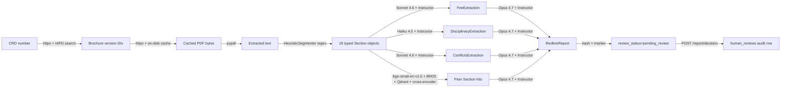

# ADV-Lens — Architecture

> **Status:** Living doc. Pipeline is feature-complete on the
> ingestion → extraction → retrieval → redline → HITL axis (Weeks 1-3).
> Week-4+ work is rigour, presentation, and operational polish — see
> `docs/user-manual.md § 9` for the roadmap.

## Pipeline (live diagram with data + tools per hop)

The Mermaid diagram below labels each edge with both *what flows
through* and *what tool acts on it* — readable as the answer to
"where does each field in the final scorecard come from?"



An ASCII fallback (for printed contexts that don't render Mermaid)
is in `docs/user-manual.md § 5.1`. The full ETL table — what gets
extracted, transformed, and loaded at every hop, with storage and
audit semantics — is in `docs/user-manual.md § 5.2`.

## Pipeline (current code, week 3)

LangGraph topology compiled by `adv_lens.app.graph.pipeline.build_pipeline`:

```text
START → fetch_brochure → segment_brochure
                           ├─→ extract_fee ──────────┐
                           ├─→ extract_disciplinary ─┼─→ retrieve_peers → write_redline → hitl_gate → END
                           └─→ extract_conflicts ────┘
```

(All five LLM/retrieval nodes are included automatically when
`ANTHROPIC_API_KEY` is set; otherwise the pipeline collapses to fetch +
segment only.)

- **fetch_brochure** (`graph/nodes/fetch.py`) — async, calls `IAPDClient`,
  resolves `brochure_version_id` via IAPD search if missing, caches the
  PDF on disk, populates `brochure_pdf_path` / `brochure_sha256`.
- **segment_brochure** (`graph/nodes/segment.py`) — sync, runs
  `HeuristicSegmenter` against the cached PDF, populates
  `segmented_brochure`. Missing items and `SegmenterError` land in
  `state.errors` rather than raising.
- **extract_fee** (`graph/nodes/extract_fee.py`) — async, Item 5 →
  `FeeExtractor` (Sonnet 4.6) → `extractions.fee`.
- **extract_disciplinary** (`graph/nodes/extract_disciplinary.py`) —
  async, Item 9 → `DisciplinaryExtractor` (Haiku 4.5) → `extractions.disciplinary`.
- **extract_conflicts** (`graph/nodes/extract_conflicts.py`) — async,
  Items 10/11/12 (concatenated) → `ConflictsExtractor` (Sonnet 4.6) →
  `extractions.conflicts`.
- **retrieve_peers** (`graph/nodes/retrieve_peers.py`) — async fan-in
  node, queries the hybrid `PeerStore` once per populated extraction
  (per-Item static query anchors, top-k from settings), filters by
  `state.brochure_aum_band` if present, excludes the subject CRD,
  populates `state.peer_context` as `PeerHit.model_dump()` dicts.
  Graceful degradation: any per-item failure or unreachable Qdrant
  yields an empty `peer_context` plus an entry in `state.errors`.
- **write_redline** (`graph/nodes/write_redline.py`) — async, composes
  the three extractor outputs + `state.peer_context` into a typed
  `RedlineReport` via `RedlineWriter` (Opus 4.7). One LLM call per
  pipeline run; bounds total Opus spend per brochure. See ADR 0008.
- **hitl_gate** (`graph/nodes/hitl_gate.py`) — sync, terminal node.
  Sets `state.review_status="pending_review"` and computes
  `state.report_hash` (SHA256 of canonical RedlineReport JSON). When
  `settings.enable_hitl=False` (dev/batch mode), auto-approves
  instead. The gate doesn't write the audit row itself —
  `POST /report/decision` writes `human_reviews` when a CCO acts.
  See ADR 0010.

The HTTP entry point (`POST /pipeline/run`) does not call the pipeline
synchronously; it inserts a `PipelineRun` row and schedules an async
runner via `asyncio.create_task`. Callers poll `GET /pipeline/run/{trace_id}`
for state. See ADR 0011. The CLI (`adv_lens.app.graph.cli`) still runs
the pipeline synchronously, which is convenient for evals and one-off
debugging.

The three extractor nodes run **in parallel** off `segment_brochure`.
Each returns only its own field of `Extractions`; the
`merge_extractions` reducer (annotated on `ADVState.extractions`)
composes them into a single populated container — see ADR 0006.
`retrieve_peers` is the fan-in point — LangGraph waits for all three
extractor branches before invoking it. Every LLM call writes one row
to `llm_calls` via the configured `AuditSink`. Langfuse callbacks
attach automatically when configured (`app/observability.py`).

## Per-node model assignment

See `docs/adr/0001-stack-choices.md` and `.env.example`.

## Known limitations (parsing + ingestion)

Two concrete classes of failure are surfaced from the first live IAPD
run on 2026-04-26 (Brown Advisory LLC, CRD 110181). Both are documented
in ADRs and the user manual; both are real, both have planned fixes,
and neither is hidden by the system at runtime.

1. **Multi-program brochures with bundled Items** (ADR 0014). Real-world
   Part 2A brochures sometimes don't follow the canonical *one Item per
   numbered section header* layout. Brown Advisory bundles Items
   5/10/11/12 narratives into per-program subsections without standalone
   ``Item N`` headers — so the regex segmenter cannot isolate them, even
   though the disclosures themselves are present in the PDF. Items 9
   (disciplinary), 15 (custody), and 16 (investment discretion) parse
   cleanly. The pipeline reports the gap as a high-severity finding
   rather than fabricating an extraction; it does not silently produce
   a confident-looking score on partial inputs. **Planned fix:** Haiku
   4.5 LLM fallback that locates Item-section spans when the regex
   produces <2,000-char bodies for any of Items 5/9/10/11/12. Per ADR
   0014, scheduled for Week 4. Triggered only on the difficult subset;
   regex stays primary.
2. **SEC IAPD URL + User-Agent fragility** (ADR 0015). The SEC retired
   the legacy ``/search/entity`` firm-search endpoint in early 2026 and
   added naive User-Agent bot detection on ``files.adviserinfo.sec.gov``
   that 404s descriptive UAs (which SEC's own guidance asks for). Both
   are patched; the diagnostic playbook is preserved in the iapd.py
   module docstring and ADR 0015 so the next migration is contained.

These are the parsing concerns that any reviewer evaluating ADV-Lens
for production use should know about. The user manual's § 9.1
roadmap entry points at the same ADRs.

## ADRs

- `docs/adr/0001-stack-choices.md` — Stack rationale.
- `docs/adr/0002-data-sources.md` — SEC IAPD / IARD ingestion contract, rate limits, cache layout. (Amended by ADR 0015.)
- `docs/adr/0003-segmenter-strategy.md` — Heuristic Item 1–18 segmenter as primary; LlamaParse fallback; sec-parser deferred to EDGAR use cases. (Amended by ADR 0014.)
- `docs/adr/0004-peer-corpus-indexing.md` — One vector per Item per brochure, named dense vectors (hybrid-ready), idempotent UUID5 point IDs, operator-curated peer JSON.
- `docs/adr/0005-extractor-pattern.md` — Per-Item extractor contract (LLMClient + Instructor + audit sink), schema design, scoring threshold, parallel-merge plan.
- `docs/adr/0006-parallel-state-composition.md` — Annotated reducer pattern for parallel extractor branches; nodes return only their own field; reducer composes.
- `docs/adr/0007-hybrid-retrieval.md` — Hashed-vocab BM25 sparse + RRF fusion + cross-encoder rerank; body in payload (revises ADR 0004 § 5).
- `docs/adr/0008-redline-output-format.md` — RedlineReport schema, severity policy in prompt, structural validator now / dual-judge scoring later.
- `docs/adr/0010-hitl-gate.md` — Marker-style HITL with audit-table decision endpoint; pinned to `report_hash` so approvals don't survive report regeneration.
- `docs/adr/0011-async-pipeline-worker.md` — In-process `asyncio.create_task` + persisted `PipelineRun` rows; restart loses in-flight work; reaper plus path to arq/procrastinate documented.
- `docs/adr/0014-segmenter-limits-multi-program-brochures.md` — Acknowledges regex segmenter's limitation on bundled-Item brochures; commits to Haiku 4.5 LLM fallback for Items 5/9/10/11/12 when regex produces tiny bodies.
- `docs/adr/0015-sec-iapd-url-and-ua-fragility.md` — Documents the 2026 SEC IAPD URL migration and bot-detection bypass; preserves the diagnostic playbook for the next migration.
- `docs/adr/0016-review-ui.md` — Server-rendered review UI for the HITL gate (FastAPI + Jinja2 + HTMX); iframes the existing redline HTML; reuses ADR 0010's audit semantics.
- ADRs 0009 + 0012-0013 to follow (LLM-as-judge + judge-drift, on-prem branch scope, peer auto-discovery from IARD).
