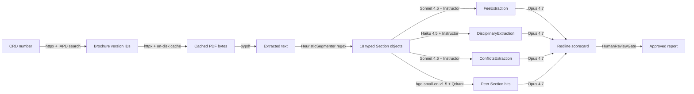

# Parking lot

Ideas captured to revisit, not to block current work. One entry per idea.
Add date + short rationale; promote to an issue or ADR when ready to act.

---

## 1. Plain-language introduction doc derived from the README

**Added:** 2026-04-24

**Largely addressed 2026-04-26** by `docs/user-manual.md` (also
rendered as `docs/user-manual.pdf` for desk-side use during
production). The manual covers the acronyms + jargon glossary + ETL
flow + sample-output shape + audit story + roadmap. **Still
outstanding:** a true 5th-grade-reading-level intro for a non-technical
family-member audience. The user manual targets a CCO + analyst +
engineer audience, not a layperson. If a layperson intro is wanted,
spin a separate `docs/intro.md` from § 1 + § 2 of the manual rewritten
at lower reading level.

**Idea (original).** Turn the current README into a second, gentler document (e.g.
`docs/intro.md`) aimed at a reader with no wealth-management background.

**What it should do:**

- Spell out every finance / regulatory acronym the README uses, and every
  acronym that appears in the pipeline: ADV, RIA, CCO, CRD, IARD, IAPD, AUM,
  SEC, FINRA, HITL, RAG, BRCHR_VRSN_ID, ERA, M&A.
- Define the industry jargon in one sentence each: "fee schedule," "peer
  brochure review," "disciplinary disclosure," "conflict of interest,"
  "annual ADV amendment," "wrap program," "custodian," "compliance exam."
- Explain the project at ~5th-grade reading level: *what a brochure is, why
  a compliance officer reads other firms' brochures, and what this project
  actually produces for them.*
- Keep the technical README as-is. The intro doc is additive, a different
  door for a different reader (hiring manager at a non-technical consulting
  shop, a CCO, a family member).

**Why not now (original).** README's current audience is engineer-literate. A second
intro doc is most useful once there's an actual output to demonstrate (end
of week 3 at earliest). Writing it before the pipeline produces a report
risks describing a thing that doesn't yet exist.

**Next check-in.** Decide whether the layperson intro is wanted as a
separate doc; if yes, ~2 hours' work to extract from the manual.

---

## 2. End-to-end data flow map (customer → final result)

**Added:** 2026-04-24

**Idea.** Single diagram + short narrative covering the full path a piece
of data takes from "a customer hands us a CRD" to "a CCO signs off on a
report." Should show:

- **Inputs.** CRD number, AUM-band filter, list of peer CRDs (optional).
- **Ingestion.** IAPD search → current brochure list → PDF fetch → cached
  under `data/brochures/`. IARD bulk CSV → filtered peer rows. Where each
  artifact is persisted.
- **Parsing.** PDF → sec-parser sections → section-typed chunks.
- **Extraction.** Fee / disciplinary / conflicts nodes, each producing a
  Pydantic object, each logging to `llm_calls`.
- **Retrieval.** Peer Qdrant filter by AUM band + strategy tag → top-k peer
  sections → hybrid (dense + BM25 + RRF + rerank).
- **Scoring.** Redline writer composes scorecard vs SEC plain-English
  expectations.
- **HITL.** Human review gate → audit row (`human_reviews`) → report
  release (or reject / revise).
- **Observability sidecar.** Langfuse trace written at every node;
  `llm_calls` table parallel audit.

**Identify and model the ETL at each hop.** For every arrow on the flow
diagram, name explicitly:

- **Extract** — what raw artifact is pulled (IAPD PDF, IARD CSV row, peer
  Qdrant hit) and the source of truth (URL, table, collection).
- **Transform** — the schema contract at the boundary (Pydantic model,
  sec-parser section type, embedding vector + metadata payload), what
  normalisation or enrichment happens (OCR fallback, AUM-band derivation,
  chunking, cross-encoder rerank), and which LLM call (if any) mediates
  the transform.
- **Load** — where the transformed artifact is persisted (on-disk cache,
  Postgres `llm_calls` / `human_reviews`, Qdrant collection, Langfuse
  trace span), with retention policy and whether it's idempotent.

This ETL table is the compliance-defensible view — a CCO reading it can
point at any field in the final scorecard and trace it back to a source
artifact, a transform, and an audit row.

Format: one mermaid / graphviz diagram in `docs/architecture.md` *or* a
dedicated `docs/data-flow.md`, accompanied by an ETL table (one row per
hop: Extract / Transform / Load / storage / cost tier / failure mode).

**Why not now.** Half the nodes don't exist yet (extractors week 2, peer
retriever week 3, redline writer week 3). Drawing a flow of hypothetical
nodes is how README drift starts. Wait until the nodes exist so the
diagram is verifiable against code.

**Next check-in.** Start of week 3 — extractors and peer retriever are
either landed or scoped; diagram becomes a week-3 planning artifact and a
week-5 polish deliverable.

---

---

## 3. Does this have a dashboard?

**Added:** 2026-04-24

**Idea.** A web dashboard for the CCO / diligence-team audience. Candidates:

- A run-history view: every pipeline invocation with CRD, brochure version,
  trace ID, status, link to the Langfuse trace, and the resulting
  scorecard / redline.
- A peer-comparison browser: pick a CRD and an AUM band, see the
  retrieved peer brochures side-by-side with the subject's fee schedule,
  disciplinary disclosures, and conflicts list.
- A HITL inbox: pending reports awaiting CCO sign-off, with approve /
  reject / revise actions that write to the `human_reviews` audit table.

Right now we have FastAPI endpoints (`/healthz`, `/brochure/{crd}`,
`/pipeline/run`) and Langfuse for observability — anyone evaluating the
project can curl the API or read traces. The README also flags a 60-90s
demo GIF as a week-5 deliverable.

**Why not now.** CLAUDE.md is explicit: *"Building a UI before the
pipeline works end-to-end. Ship a UI only after the agent and eval harness
are solid."* The redline writer doesn't exist yet, so a dashboard would be
furniture around an empty room. Langfuse already covers the
"observability for a CCO" need that any v0 dashboard would duplicate.

**Next check-in.** End of week 5. By then the pipeline produces a real
scorecard, the eval harness scores it, and the demo-GIF requirement
forces the question anyway. Decide then between (a) a thin Streamlit/Next
front-end versus (b) leaning on Langfuse + a static HTML report and
calling it shipped.

---

## 4. Let the user choose where the output file is saved

**Added:** 2026-04-24

**Idea.** Add `--out <path>` (or `--out-dir <dir>`) to every CLI that
emits an artifact, plus a per-request override on the FastAPI side:

- `adv_lens.ingestion.cli fetch-brochure --out data/2026Q2/<CRD>.pdf`
- `adv_lens.segmenter.cli ... --out sections.json`
- `adv_lens.app.graph.cli ... --out advlens-state.json`
- `eval.runner --out-dir eval/results/<custom>` (currently auto-named).
- `POST /pipeline/run` body field `output_target` for an S3 / local-path
  destination.

**Why not now.** Today every CLI writes to stdout (or a content-addressed
default like `data/brochures/<CRD>/<BRCHR_VRSN_ID>.pdf`), which composes
cleanly with shell redirection (`> file.json`, `| jq`, `| tee`). The
content-addressed default for brochures is also load-bearing for the
on-disk cache — a user-chosen path defeats the cache invariant unless we
add an indirection layer. Adding `--out` early also forks the surface
area before extractor / redline outputs exist; once those land in week 3
the right shape is "this run produced *N* artifacts, here's the bundle"
not "where do I put the one PDF."

**Next check-in.** Week 3, when the redline writer lands. At that point
a single pipeline run produces ≥3 artifacts (state JSON, scorecard
markdown, audit excerpt). Design the output-bundle layout once and apply
`--out-dir` consistently across all CLIs and the HTTP endpoint, rather
than retrofitting one flag at a time. Until then: shell redirection.

---

---

## 5. How is the workflow triggered?

**Added:** 2026-04-24

**Idea.** Today the pipeline runs three ways: CLI
(`python -m adv_lens.app.graph.cli <CRD>`), FastAPI (`POST /pipeline/run`),
and the pytest harness. All three are *on-demand, single-CRD, synchronous*.
A real CCO or M&A workflow needs richer triggers:

- **Watchlist + scheduled.** A CCO subscribes a list of peer CRDs and the
  pipeline re-runs every quarter when SEC posts updated brochures. Maps
  to the brief's Week-6 ADV-Diff bolt-on (quarterly change detector).
- **Filing-event webhook.** When a watched CRD's `BRCHR_VRSN_ID` changes
  on IAPD, fire the pipeline and route the diff to the CCO. Requires a
  poller against IAPD search since SEC doesn't push events.
- **Batch / portfolio mode.** M&A diligence team uploads a CSV of target
  CRDs; the pipeline fans out, persists per-CRD scorecards, emits one
  bundle. Different audit-trail shape (one run, N reports).
- **Inbox-driven.** CCO emails / Slacks a CRD or a brochure URL; an
  ingest worker enqueues a pipeline run and replies with the result.
- **CI-style trigger.** A pull request against a peer-corpus YAML
  re-runs the eval harness and the pipeline against the changed CRDs;
  results post back to the PR. Useful for the project itself, not the
  product.

**Why not now.** With only fetch + segment landed (no extractors, no
redline, no HITL gate), there's nothing for a scheduled trigger to deliver
to a human yet. Every async-trigger option above also wants Postgres-backed
job state (Celery / RQ / arq) — a layer worth designing once, after the
synchronous pipeline produces a real artifact. Picking the trigger model
before the artifact exists is also how you end up with cron jobs that
produce empty reports for a quarter.

**Next check-in.** Start of week 3, alongside the redline writer and HITL
gate. Two questions to decide then:

1. Sync vs async pipeline execution. The Day-4 README already flags
   `POST /pipeline/run` as "moves to a background worker when the redline
   writer arrives in week 3." Pick the queue at that point (lean toward
   `arq` for the Postgres + asyncio fit; revisit if Langfuse needs
   change).
2. Trigger surface for v0. Default position: keep CLI + HTTP for week 3
   MVP, ship the watchlist + cron-style trigger as Week-6 ADV-Diff. Don't
   build webhooks unless a hiring conversation demands it.

---

---

## 6. Visual sample of the input data in the instruction manual

**Added:** 2026-04-24

**Done 2026-04-26.** Three PNGs of the live Brown Advisory run embedded
in user manual § 3.1: IAPD firm summary page (CRD/SEC# resolution), Item 5
multi-program tiered fee schedules (page 13 of brochure), Item 9
"no disciplinary history" disclosure (page 43). Rendered via pypdfium2
for the brochure pages and Chrome --headless --screenshot for the IAPD
firm-summary page. All three under `docs/images/`; all three appear in
`docs/user-manual.pdf`.

**Idea.** Add 1-2 screenshots / clipped page images of an actual Form ADV
Part 2A brochure to the README (or `docs/intro.md` once entry #1 lands).
Goal: a reader who's never seen one can confirm at a glance that the
seed data really is "this 30-page PDF the SEC publishes for every RIA,"
not some derived summary or scraped CSV. Specifically:

- One Item 5 (Fees and Compensation) clipping showing a typical
  fee-schedule table — anchors what the Fee Extractor is supposed to
  read.
- One Item 9 (Disciplinary Information) clipping with a "Not applicable"
  paragraph — anchors what an empty section looks like and why the
  segmenter has an `is_placeholder` flag.
- Optional: an IAPD firm summary page screenshot showing the
  brochure-list panel — anchors how a CRD resolves to a `BRCHR_VRSN_ID`.

Save as PNGs under `docs/images/` and reference from the README and
intro doc.

**Why not now.** No real brochures cached yet (no Anthropic-keyed runs;
the eval golden set is synthetic). Screenshotting a real RIA's brochure
without context risks looking like we're singling them out — better to
pick a deliberately neutral example (e.g., a registered investment
adviser the brief already names like Yale endowment's reporting agent,
or a synthetic-but-realistic mock generated for the demo). This pairs
with entry #1 (plain-language intro) and entry #4 (output bundle
layout) — the input visual and the output sample land together as a
coherent "here's what goes in, here's what comes out" story.

**Next check-in.** Week 5, alongside the demo GIF and intro doc. By
then we have real brochures cached locally, the redline writer
produces a real output sample, and we can pick neutral example firms
that won't read as targeting anyone.

---

## 7. Mermaid workflow diagram showing data + tools per hop

**Added:** 2026-04-24

**Done 2026-04-26** in `docs/architecture.md § Pipeline (live diagram
with data + tools per hop)`. ASCII fallback for printed contexts is in
`docs/user-manual.md § 5.1`. Full ETL table is in
`docs/user-manual.md § 5.2`.

**Idea.** Replace the ASCII pipeline diagram in `docs/architecture.md`
with a Mermaid diagram that GitHub renders inline and that labels each
hop with both **the data flowing through** and **the tool acting on
it.** Sketch:

Each edge label answers two questions a reader would ask: *"what does
this hop receive?"* and *"what tool produces what comes out?"* This
overlaps entry #2 (ETL flow map) but sharpens the answer to the second
question: *the tool*, not just *the transform*. Also useful as the
diagram embedded in the demo GIF.

**Why not now.** Half the nodes (disciplinary, conflicts, peer
retriever-as-graph-node, redline writer, HITL gate) don't exist yet.
Drawing edges to nodes that don't compile is exactly the README-drift
trap entry #2 already flagged. Wait for week 3 MVP — at that point
every node on the diagram is real code, and the diagram becomes a
verification artifact rather than aspiration.

**Next check-in.** Start of week 5 (polish). By then the pipeline is
end-to-end (week 3) and the eval harness has been cycling against it
for a week (week 4), so the diagram lines up with code that actually
runs. Co-land with the input-visual entry above so docs/architecture.md
gets a coherent refresh in one PR.

---

*Add new ideas below with `## N. <title>` and the same four sections
(Idea / Why not now / Next check-in).*
