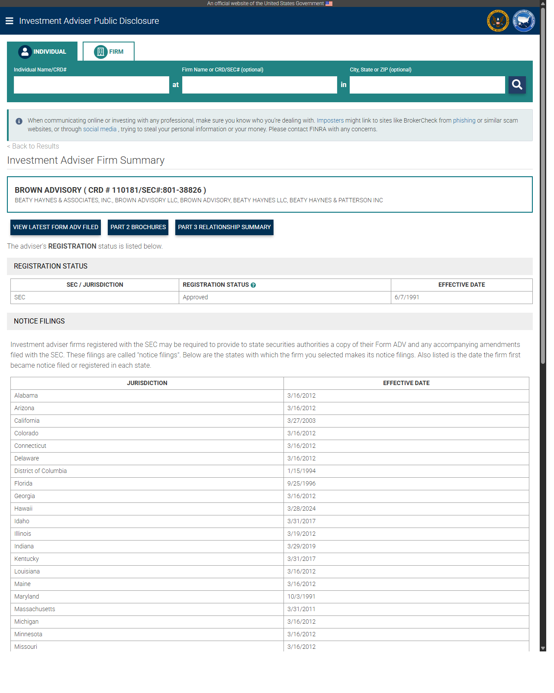
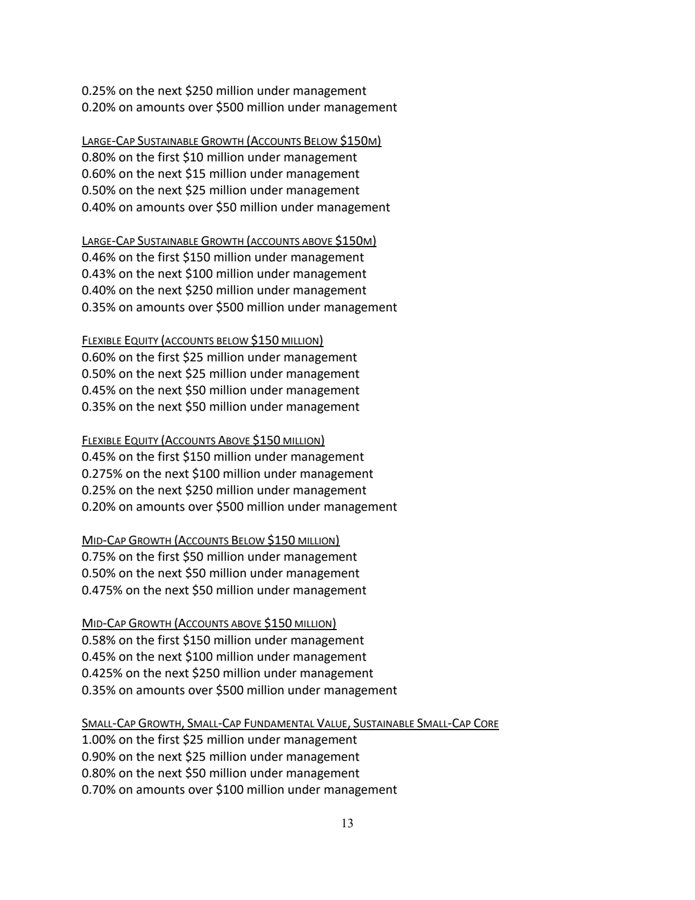
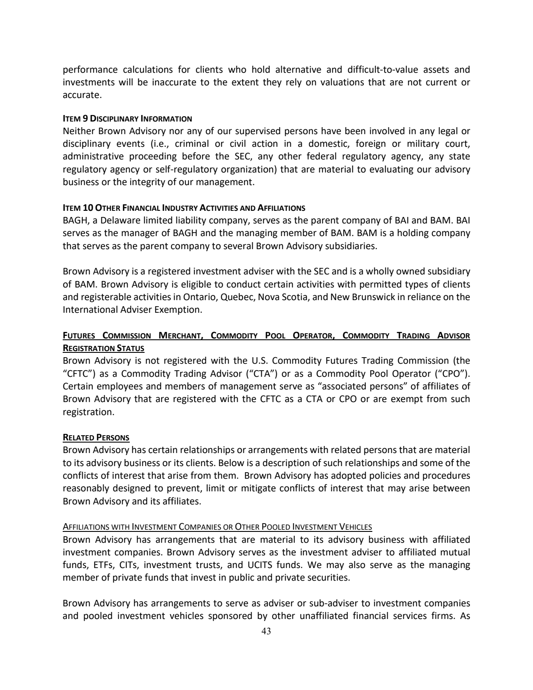
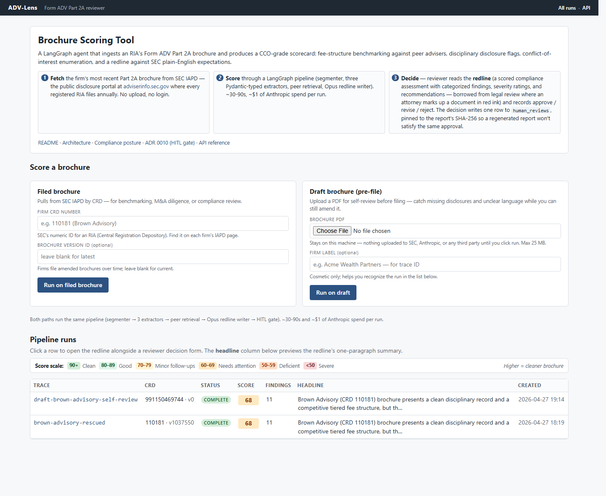
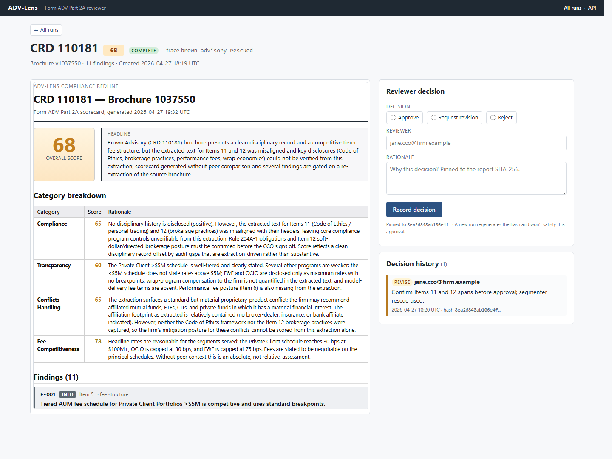

# 1. What this is, in plain English

ADV-Lens reads a registered investment adviser's regulatory disclosure
brochure (the SEC Form ADV Part 2A — see the vocabulary section if any of
that is unfamiliar) and produces a structured **redline report** that a
Chief Compliance Officer can use to:

- spot disclosure weaknesses against SEC plain-English expectations,
- compare the firm's fees, conflicts, and disciplinary disclosures to a
  cohort of peer brochures of similar size and strategy,
- have a defensible audit trail of what the system extracted, what it
  flagged, and which human approved or rejected the report.

It is **not** legal advice. It is **not** an auto-publisher. It is **not**
a substitute for CCO judgment. Every report leaves the system only after
a human review gate writes a row to an audit table.

The intended day-to-day reader is a CCO at a mid-market RIA, an M&A
diligence analyst evaluating a target adviser, or a wealth-management
consulting team reviewing a client's filing posture.

---

# 2. The vocabulary

Every piece of jargon that appears in this manual or in the system, in
one sentence each. Skim, then come back when you hit a term you don't
recognise.

## 2.1 Acronyms

| Acronym | Stands for | What it means in this system |
|---|---|---|
| ADV | (no expansion — the SEC's form name) | The registration form every SEC- or state-registered investment adviser files. **Part 2A** is the public disclosure brochure ADV-Lens reads. |
| RIA | Registered Investment Adviser | A firm that gives investment advice for compensation and is registered with the SEC or a state regulator. |
| CCO | Chief Compliance Officer | The named person at an RIA accountable for compliance with the Advisers Act. The intended human user of ADV-Lens. |
| CRD | Central Registration Depository | The unique numeric identifier the SEC and FINRA use for every adviser firm and individual. ADV-Lens keys everything off the firm's CRD. |
| IARD | Investment Adviser Registration Depository | The SEC system advisers file ADV through. The bulk download contains every active adviser's Part 1 record. |
| IAPD | Investment Adviser Public Disclosure | The public-facing SEC website that publishes every adviser's brochures. ADV-Lens fetches PDFs from `files.adviserinfo.sec.gov`. |
| AUM | Assets Under Management | Total client assets the firm manages. ADV-Lens uses an AUM band ($0-$1B, $1-5B, $5-50B, $50B+) as a peer-cohort filter. |
| SEC | Securities and Exchange Commission | Federal regulator. Registers and examines RIAs above $100M AUM (state regulators handle smaller). |
| FINRA | Financial Industry Regulatory Authority | Self-regulator for broker-dealers; runs BrokerCheck, the public lookup for adviser/broker disciplinary history. |
| HITL | Human-In-The-Loop | A pipeline pattern where machine output is gated on a human approval step before being released. ADV-Lens's `HumanReviewGate` node implements this. |
| RAG | Retrieval-Augmented Generation | Pulling relevant text from a knowledge store and feeding it to an LLM as context. ADV-Lens uses RAG to put peer-brochure excerpts in front of the redline writer. |
| BRCHR_VRSN_ID | Brochure Version ID | The SEC's per-version identifier for a specific filing of a brochure. The same firm can have multiple brochures (e.g., wrap fee program disclosure plus main brochure). |
| ERA | Exempt Reporting Adviser | A firm that meets a registration exemption but still files an abbreviated ADV. ADV-Lens does not currently process ERAs; it targets full Part 2A filings. |
| M&A | Mergers and Acquisitions | One target use case: an acquirer's diligence team reading a target adviser's ADV. |
| ADR | Architecture Decision Record | A short markdown file in `docs/adr/` capturing one design decision and its consequences. Eleven exist today. |

## 2.2 Industry jargon

| Term | One-sentence definition |
|---|---|
| Fee schedule | The firm's published pricing — typically a tiered percentage of AUM, sometimes flat retainer or hourly, found in **Item 5** of the ADV. |
| Conflict of interest | Any arrangement that gives the firm a financial incentive to act against a client's interest — affiliated funds, soft dollars, principal trading, etc. Disclosed in **Items 10/11/12**. |
| Disciplinary disclosure | Any past regulatory, criminal, or civil action involving the firm or its principals. Disclosed in **Item 9**. The CCO must keep this current. |
| Annual ADV amendment | Every adviser must file an updated ADV within 90 days of fiscal-year end. ADV-Lens sees the most recent filing on IAPD. |
| Wrap fee program | A bundled-fee program where one charge covers advice + execution + custody. Has its own brochure variant (Part 2A Appendix 1). |
| Custodian | The bank or broker-dealer that holds client assets. Disclosed in **Item 12** when relevant. |
| Compliance exam | The SEC or state regulator's periodic on-site review of an adviser's books, records, and disclosures. ADV-Lens is designed to make exam prep cheaper, not to replace exam-readiness work. |
| Soft dollars | Research or services a custodian provides to the adviser in exchange for client trading commissions — disclosed in Item 12 and gated by the **§ 28(e) safe harbor**. |
| Performance fee | Compensation tied to investment performance (e.g., 20% of gains). Permitted only with qualified clients; disclosed in Item 5. |
| Code of Ethics | A firm's written rules governing personal trading by access persons, required by Rule 204A-1, summarised in Item 11. |

If a term in this manual is not in the table above, it appears in the
parking-lot doc (`docs/parking-lot.md`) or the architecture doc as a
candidate for inclusion.

---

# 3. What goes in: a Form ADV Part 2A brochure

The system's input is a single PDF — the firm's most recent Part 2A
brochure as published on IAPD. Brochures are typically 30–80 pages and
follow a fixed structure of 18 numbered Items the SEC mandates.

| Item | Title | What's in it |
|---|---|---|
| 1 | Cover Page | Firm name, address, contact, brochure date. |
| 2 | Material Changes | Summary of changes since last annual amendment. |
| 3 | Table of Contents | Required structural element. |
| 4 | Advisory Business | Firm history, ownership, services, total AUM. |
| **5** | **Fees and Compensation** | **Fee schedules, billing, third-party costs.** Read by the Fee Extractor. |
| 6 | Performance-Based Fees | Disclosure if any. |
| 7 | Types of Clients | Individuals, pensions, funds, etc. |
| 8 | Methods of Analysis | Investment process. |
| **9** | **Disciplinary Information** | **Regulatory, criminal, civil actions.** Read by the Disciplinary Extractor. |
| **10** | **Other Financial Industry Activities and Affiliations** | **Affiliated B/D, insurance, fund complex, bank.** Read by the Conflicts Extractor (part 1 of 3). |
| **11** | **Code of Ethics, Personal Trading, Participation in Client Transactions** | **Personal-trading policy, material conflicts.** Read by the Conflicts Extractor (part 2 of 3). |
| **12** | **Brokerage Practices** | **Soft dollars, directed brokerage, trade aggregation.** Read by the Conflicts Extractor (part 3 of 3). |
| 13 | Review of Accounts | Account-review cadence and triggers. |
| 14 | Client Referrals & Other Compensation | Referral arrangements. |
| 15 | Custody | Custody arrangements and account-statement delivery. |
| 16 | Investment Discretion | Discretionary authority granted. |
| 17 | Voting Client Securities | Proxy-voting policy. |
| 18 | Financial Information | Pre-paid fees, financial condition, bankruptcy disclosures. |

ADV-Lens reads **Items 5, 9, 10, 11, 12** with dedicated LLM extractors.
The other 13 Items are segmented and stored but not currently scored —
they're available for future extractors.

### 3.1 What the input actually looks like

The three images below are from the live Brown Advisory run on
2026-04-26 — a deliberately neutral mid-size RIA, no recent compliance
noise, multi-program brochure structure (the kind that exercises both
the regex segmenter and the LLM rescue per ADR 0014).

**The IAPD firm summary page** — what a CRD resolves to. The "PART 2
BROCHURES" button links to the per-brochure PDF the system actually
fetches. Brown Advisory: CRD 110181, SEC# 801-38826, registered
6/7/1991.



**Item 5 — Fees and Compensation** (page 13 of the brochure). A
multi-program tiered AUM fee schedule. Each program lists breakpoints
in plain English; the fee extractor's job is to recover these into
structured `FeeSchedule` / `FeeTier` objects.



**Item 9 — Disciplinary Information** (page 43 of the brochure). The
canonical "no disciplinary history" disclosure pattern: *"Neither Brown
Advisory nor any of our supervised persons have been involved in any
legal or disciplinary events..."*. The disciplinary extractor's job is
to recognise this as `has_disciplinary_history: false` rather than
hallucinating events from the surrounding text.



---

# 4. What comes out: the Redline Report

The system's output is a `RedlineReport` Pydantic object, serialised to
JSON and (after the audit-trail bundle work — see § 9) optionally
rendered as a 1-page HTML/PDF for printing or emailing to the CCO.

## 4.1 Structure

A RedlineReport contains:

- `brochure_crd` and `brochure_version_id` — exact provenance.
- `scorecard` — an overall score (0-100) plus four mandatory category
  sub-scores, each 0-100 with a one-sentence rationale:
  - **compliance** — does the brochure meet SEC plain-English and
    coverage expectations?
  - **transparency** — are fees, conflicts, and risks disclosed clearly?
  - **conflicts_handling** — when conflicts exist, is the mitigation
    explained?
  - **fee_competitiveness** — relative to the AUM-band peer cohort.
- `findings` — between 4 and 12 individual flagged items, each with:
  - a stable ID (`F-001`, `F-002`, …),
  - a `category` tag (e.g. `compliance_program`, `fee_structure`, `conflicts`),
  - a severity (`info` / `low` / `medium` / `high` / `critical`),
  - an `item_reference` — the ADV Item number the finding cites
    (null for cross-Item issues),
  - a `summary` (one sentence) and a `detail` (one paragraph),
  - a `sec_expectation_ref` pointing at the specific Form ADV
    instruction or Advisers Act rule the expectation derives from,
  - an optional `peer_comparison` populated when peer context was
    available,
  - a `recommendation` — what the CCO should actually do.
- `peer_comparisons` — list of cross-firm comparisons keyed on extracted
  field, populated when peer context was available.
- `extraction_warnings_seen` — surfaces any `extraction_warnings` that
  the upstream extractors emitted, so the redline writer's interpretive
  judgment is auditable.
- `notes` — free-form notes from the redline writer about caveats,
  upstream input quality, or limits on the assertions made.

The schema lives in `src/adv_lens/extractors/schemas.py` (`RedlineReport`,
`Scorecard`, `ScoreCategory`, `Finding`).

## 4.2 Sample (real run, 2026-04-26 — with LLM rescue)

The first live end-to-end run against a real IAPD brochure: **Brown
Advisory LLC** (CRD 110181, BRCHR_VRSN_ID 1037550, brochure filed
2026-03-31). Full artifact at
[`docs/examples/sample-report.json`](examples/sample-report.json) (19KB,
redline + provenance metadata) and the full pipeline state at
`docs/examples/sample-state.json` (~290KB).

> **Honest commentary on this sample.** The overall_score is 68. The
> brochure has a non-canonical multi-program structure — only Items
> 2/3/4/9/15/16 have ALL-CAPS narrative headers; Items 5/10/11/12 lack
> standalone section headers because their content is bundled into
> per-program subsections. The pipeline handled this in two stages:
>
> 1. The regex `HeuristicSegmenter` caught Items 2/3/4/9/15/16 cleanly
>    (Item 9 = no disciplinary disclosures, a score-positive signal)
>    but produced 0–144-char fragments for Items 5/10/11/12.
> 2. The **ADR 0014 LLM rescue** kicked in: Haiku 4.5 located the real
>    spans for the four missing Items in one prompt round-trip,
>    producing 3,452 / 3,813 / 16,544 / 18,120-char bodies for
>    Items 10 / 11 / 5 / 12 respectively. Backend tag on the resulting
>    `SegmentedBrochure` is `heuristic+llm_fallback`, with a warning
>    recording exactly which Items were rescued.
>
> Qdrant remained offline for this run, so `retrieve_peers` degraded
> gracefully (empty `peer_context`) and the redline writer noted the
> absence of peer benchmarking in its headline.
>
> Of the 11 findings, 3 are high-severity (re-extraction of misaligned
> Items 11/12 spans recommended), 4 medium, 2 low, 2 info. F-001 is a
> *positive* info-severity finding documenting that the Private Client
> >$5M schedule's 100→30 bp tiered structure is industry-standard.
>
> The portfolio claim is now demonstrable end-to-end: *"we extract Items
> 5/9/10/11/12 from canonical and multi-program brochures alike, with a
> deterministic-first / LLM-rescue-as-fallback architecture, and surface
> any remaining gaps as findings rather than hiding them."* Full
> diagnostic in [ADR 0014](adr/0014-segmenter-limits-multi-program-brochures.md);
> the SEC URL/UA migration story patched in this same session is in
> [ADR 0015](adr/0015-sec-iapd-url-and-ua-fragility.md).

```json
{
  "meta": {
    "crd": "110181",
    "brochure_version_id": "1037550",
    "trace_id": "brown-advisory-rescued",
    "review_status": "pending_review",
    "segmenter_backend": "heuristic+llm_fallback"
  },
  "redline": {
    "scorecard": {
      "overall_score": 68,
      "headline": "Brown Advisory (CRD 110181) brochure presents a clean disciplinary record and a competitive tiered fee structure, but the extracted text for Items 11 and 12 was misaligned and key disclosures (Code of Ethics, brokerage practices, performance fees, wrap economics) could not be verified from this extraction; scorecard generated without peer comparison and several findings are gated on a re-extraction of the source brochure.",
      "categories": [
        {"name": "compliance",          "score": 65, "rationale": "No disciplinary history disclosed (positive). Extracted text for Items 11 (Code of Ethics) and 12 (brokerage) was misaligned with their headers, leaving core compliance-program controls unverifiable from this extraction."},
        {"name": "transparency",        "score": 60, "rationale": "Private Client >$5M schedule is well-tiered and clearly stated. Other programs are weaker: <$5M schedule does not state rates above $5M; E&F and OCIO are disclosed only as maximum rates with no breakpoints; wrap-program compensation to the firm is not quantified."},
        {"name": "conflicts_handling",  "score": 65, "rationale": "Standard but material proprietary-product conflict surfaced (firm may recommend affiliated funds/CITs in which it has a financial interest). No B/D, insurance, or banking affiliation footprint visible in the extraction."},
        {"name": "fee_competitiveness", "score": 78, "rationale": "Headline rates are reasonable: Private Client reaches 30 bps at $100M+, OCIO is capped at 30 bps, E&F is capped at 75 bps. Fees stated to be negotiable. Without peer context this is an absolute, not relative, assessment."}
      ]
    },
    "findings": [
      {
        "id": "F-001",
        "category": "fee_structure",
        "severity": "info",
        "item_reference": 5,
        "summary": "Tiered AUM fee schedule for Private Client Portfolios >$5M is competitive and uses standard breakpoints.",
        "detail": "The Private Client Portfolios >$5M schedule begins at 100 bps on the first $5M and steps down through 75/50/35/30 bps, with a top breakpoint at $100M. Billing is quarterly and fees are stated to be negotiable. Structure appears consistent with industry norms for high-net-worth discretionary management.",
        "sec_expectation_ref": "Form ADV Part 2A Instructions, Item 5.A (fee schedule disclosure)",
        "peer_comparison": null,
        "recommendation": "No action required. Document the schedule in the firm's fee-comparison file for next annual review."
      },
      {
        "id": "F-002",
        "category": "fee_structure",
        "severity": "low",
        "item_reference": 5,
        "summary": "Private Client <$5M schedule is ambiguous: only the first $5M is tiered; no rate stated for assets above $5M.",
        "detail": "The <$5M schedule shows 125 bps on the first $3M and 100 bps from $3M-$5M, but does not state a rate for assets above $5M. The extractor's working hypothesis is that this schedule applies only when the $5M minimum is waived. The brochure language as extracted may leave a sub-$5M client unclear about how growth above $5M would be billed.",
        "sec_expectation_ref": "Form ADV Part 2A Instructions, Item 5.A (plain-English fee description)",
        "peer_comparison": null,
        "recommendation": "Review the source brochure text to confirm whether the schedule rolls into the >$5M grid once a sub-minimum account crosses $5M. If ambiguous, escalate to disclosure counsel for a clarifying edit at the next amendment."
      }
    ]
  }
}
```

The full report has 11 findings (3 high, 4 medium, 2 low, 2 info). The
3 high-severity findings recommend re-extracting Items 11 and 12 where
the LLM rescue produced misaligned spans the redline writer detected in
its content review.
Read [`docs/examples/sample-report.json`](examples/sample-report.json)
for the complete artifact including provenance (`brochure_sha256`,
`report_hash`) used by the audit-trail mechanism.

## 4.3 How to read the score

- **90+** — exemplary. Use as a peer-benchmark reference.
- **80-89** — solid. Address 2-3 medium findings before next annual
  amendment; no exam concern.
- **70-79** — adequate. Address all medium and high findings before
  next amendment; prepare a remediation memo for exam file.
- **60-69** — weak. Triggers a formal disclosure-improvement project.
- **Below 60** — material disclosure gap. Engage outside compliance
  counsel; do not rely on the brochure as currently filed.

These thresholds are advisory, not regulatory. Your compliance counsel
sets the actual remediation bar.

## 4.4 How to read the findings

Each finding cites the ADV Item it relates to and has a severity. The
severity scale is calibrated to **what would change at exam**, not to
what would change a hiring decision:

- **critical** — likely violates a specific Advisers Act rule or
  Marketing Rule provision. Fix before any new client onboarding.
- **high** — material disclosure gap an SEC examiner would request a
  written explanation for. Fix before next amendment.
- **medium** — clarity or completeness gap that would draw a comment
  letter but not a deficiency finding. Fix in next amendment cycle.
- **low** — stylistic or minor structural improvement. Address
  opportunistically.
- **info** — observation, not a defect. Common when the system finds
  something noteworthy but not actionable.

A finding without a numeric Item reference signals a cross-Item issue
(e.g., contradiction between Item 5 fees and Item 12 brokerage).

---

# 5. How the system works

## 5.1 Pipeline at a glance

```
     ┌────────────────────────────────────────────────────────┐
     │                                                        │
 CRD │     ┌──────────────┐   ┌───────────────────┐           │
─────┼────►│ fetch_       │──►│ segment_brochure  │           │
     │     │ brochure     │   │ (HeuristicSeg)    │           │
     │     └──────────────┘   └─────────┬─────────┘           │
     │                                  │                     │
     │              ┌───────────────────┼───────────────────┐ │
     │              ▼                   ▼                   ▼ │
     │     ┌──────────────┐  ┌──────────────────┐  ┌────────────┐
     │     │ extract_fee  │  │ extract_         │  │ extract_   │
     │     │ (Sonnet 4.6) │  │ disciplinary     │  │ conflicts  │
     │     │              │  │ (Haiku 4.5)      │  │ (Sonnet 4.6│
     │     └───────┬──────┘  └─────────┬────────┘  └─────┬──────┘
     │             │                   │                 │     │
     │             └────────┬──────────┴─────────────────┘     │
     │                      ▼                                  │
     │       ┌─────────────────────────────────┐               │
     │       │ retrieve_peers                  │               │
     │       │ (Qdrant hybrid: dense+BM25+RRF  │               │
     │       │  + cross-encoder rerank)        │               │
     │       └────────────────┬────────────────┘               │
     │                        ▼                                │
     │             ┌──────────────────────┐                    │
     │             │ write_redline        │                    │
     │             │ (Opus 4.7)           │                    │
     │             └──────────┬───────────┘                    │
     │                        ▼                                │
     │             ┌──────────────────────┐                    │
     │             │ hitl_gate            │  → audit row       │
     │             │ (marker-style)       │    on /report/decision
     │             └──────────────────────┘                    │
     │                                                         │
     └─────────────────────────────────────────────────────────┘
                          ↓
                 RedlineReport JSON
                 (+ audit trail in Postgres)
```

A live Mermaid version of the same diagram is in
`docs/architecture.md` (§ Pipeline) — GitHub renders it inline.

## 5.2 ETL at each hop

For each arrow in the diagram, this table names the **Extract**, the
**Transform**, and the **Load** so a CCO can trace any field in the final
scorecard back to a source artifact, a transform, and an audit row.

| Hop | Extract | Transform | Load |
|---|---|---|---|
| CRD → IAPD search | HTTPS GET to `api.adviserinfo.sec.gov` (rate-limited 5 rps) | JSON → `BrochureRef` Pydantic | `data/brochures/<CRD>/index.json` |
| IAPD search → PDF | HTTPS GET to `files.adviserinfo.sec.gov/...pdf` | bytes → SHA-256 + cache key | `data/brochures/<CRD>/<BRCHR_VRSN_ID>.pdf` (idempotent) |
| PDF → text | `pypdf` page iteration | text concat with page boundaries | in-memory `str` (passed to segmenter) |
| text → 18 sections | `HeuristicSegmenter` (regex on Item 1 / Item 2 / … headings) | `dict[ItemNumber, SectionBody]` → `SegmentedBrochure` Pydantic | in-memory; persisted in `state.segmented_brochure` |
| Item 5 → fee extraction | LLM call (Sonnet 4.6 via Instructor) | structured JSON → `FeeExtraction` Pydantic | one row in `llm_calls` (input/output/tokens/cost), one field in `state.extractions` |
| Item 9 → disciplinary extraction | LLM call (Haiku 4.5 via Instructor) | structured JSON → `DisciplinaryExtraction` Pydantic | one row in `llm_calls`, one field in `state.extractions` |
| Items 10/11/12 → conflicts extraction | LLM call (Sonnet 4.6 via Instructor) | structured JSON → `ConflictsExtraction` Pydantic | one row in `llm_calls`, one field in `state.extractions` |
| extractions → peer hits | Qdrant query per Item (5/9/10/11/12) with AUM-band filter, exclude self-CRD | dense `bge-small-en-v1.5` + sparse hashed BM25 → RRF fusion → cross-encoder rerank (`ms-marco-MiniLM-L-6-v2`) | `state.peer_context: list[dict]` (PeerHit dumps) |
| extractions + peers → redline | LLM call (Opus 4.7 via Instructor) | structured JSON → `RedlineReport` Pydantic + structural validator | one row in `llm_calls`, `state.redline` |
| redline → review marker | `compute_report_hash(redline)` SHA-256 | sets `state.review_status="pending_review"`, `state.report_hash` | `pipeline_runs.result` (full state JSON) |
| CCO POST `/report/decision` | HTTP request body | `HumanReviewDecision` Pydantic | one row in `human_reviews` (decision, reviewer, rationale, report_hash) |

Every LLM call additionally emits a Langfuse trace span when
Langfuse is configured (one trace per `trace_id`, one span per node).

## 5.3 Per-node breakdown

See `docs/architecture.md § Pipeline (current code)` for the full,
code-citing description of each node. The short version:

- **fetch_brochure** resolves the most recent brochure version for the
  CRD (or uses a caller-supplied `BRCHR_VRSN_ID`), fetches the PDF
  with a content-addressed cache, populates SHA-256 + cache-status flags
  on the state.
- **segment_brochure** runs the regex segmenter; missing Items land in
  `state.errors` rather than raising. This means a brochure missing
  Item 9 still flows through the rest of the pipeline.
- **extract_fee / extract_disciplinary / extract_conflicts** run in
  **parallel** off the segmenter via LangGraph's parallel-edges pattern
  with a custom `merge_extractions` reducer (ADR 0006). Each returns
  only its own field; the reducer composes them.
- **retrieve_peers** is the fan-in node. It waits for all three
  extractors to complete before it issues per-Item Qdrant queries.
- **write_redline** is the single Opus 4.7 call per pipeline run. Output
  is structurally validated before it leaves the node.
- **hitl_gate** is **marker-style** (sets `review_status="pending_review"`
  + `report_hash`), not a true LangGraph `interrupt_before`. ADR 0010
  documents why.

## 5.4 Per-node model assignment

| Node | Model | Why |
|---|---|---|
| `fetch_brochure` | (no LLM) | Pure I/O |
| `segment_brochure` | (no LLM) | Regex |
| `extract_fee` | Sonnet 4.6 | Numeric tables + categorical fields; benefits from Sonnet's structured-output discipline |
| `extract_disciplinary` | Haiku 4.5 | Disciplinary disclosures are short and largely categorical; Haiku is fast and cheap |
| `extract_conflicts` | Sonnet 4.6 | Three concatenated Items, lots of conditional fields; Sonnet handles the longer context |
| `retrieve_peers` | (no LLM) | Vector + lexical search; cross-encoder rerank is a bge model |
| `write_redline` | Opus 4.7 | Synthesises 4 inputs into a defensible scorecard + findings; one call per run is the cost cap |

Per-node assignments are environment-overridable via `MODEL_*` env vars
(see § 10.3).

---

# 6. Running the system

## 6.1 Prerequisites

- Python 3.12 + `uv` (see `pyproject.toml` for exact deps)
- Docker + Docker Compose (for Postgres + Qdrant + Langfuse)
- `ANTHROPIC_API_KEY` in `.env` for any extraction or redline run
- Optional: `LANGFUSE_*` keys after first compose-up, for trace visibility

## 6.2 First boot

```bash
cp .env.example .env
# edit .env: paste ANTHROPIC_API_KEY, leave LANGFUSE_* blank for now
docker compose up -d
# visit http://localhost:3000 to provision Langfuse, paste back the
# LANGFUSE_PUBLIC_KEY / LANGFUSE_SECRET_KEY
uv run python -m adv_lens.app.web.seed   # one-shot: seed dashboard demo rows
uv run uvicorn adv_lens.app.main:app --reload
```

**Open <http://localhost:8000/review> in a browser** — that's the
reviewer dashboard. Health check: `GET http://localhost:8000/healthz`.
FastAPI auto-docs: `GET http://localhost:8000/docs`.

**Windows / PowerShell users.** The bash-style ``VAR=value cmd``
prefix doesn't work; use ``$env:VAR = "value"`` on its own line.
Example for sqlite-only quickstart (no Docker):

```powershell
$env:POSTGRES_DSN = "sqlite:///./data/adv_lens_dev.db"
uv run python -m adv_lens.app.web.seed
uv run uvicorn adv_lens.app.main:app --port 8000 --reload
```

## 6.3 The reviewer dashboard at `/review`

The intended day-to-day surface for a CCO or analyst. Server-rendered
(FastAPI + Jinja2 + HTMX), no SPA build step, no client-side state.
Ships in `src/adv_lens/app/web/` and is mounted on the same FastAPI
app the JSON endpoints below run on.



### 6.3.1 What the page shows

- **Intro panel** — one-paragraph elevator pitch + 3-step workflow
  strip (fetch / score / decide) + deep links to README, architecture,
  compliance, ADR 0010 (HITL design), and `/docs` (the FastAPI auto-
  docs for the JSON API).
- **Score-a-brochure form** — two side-by-side panels:
  - **Filed brochure** — CRD + optional brochure version ID. Submits
    to `POST /review/runs`, which inserts a `pipeline_runs` row in
    `queued` status and schedules the runner. Pulls the brochure from
    SEC IAPD by CRD; for benchmarking, M&A diligence, or compliance
    review of a competitor.
  - **Draft brochure (pre-file)** — file picker + optional firm label.
    Submits to `POST /review/runs/upload`. Validates `%PDF` magic bytes,
    size (≤25 MB), non-empty body. Computes SHA-256, fabricates a
    synthetic numeric CRD (`99` + 10 hash-derived digits — the prefix
    marks it as not-a-real-CRD), and writes the bytes to the cache
    path that `fetch_brochure_node` would otherwise populate. The
    pipeline then runs unchanged: `iapd.fetch_brochure` checks
    `path.exists()` first and never hits SEC IAPD for drafts.
    For a CCO scoring this year's amendment before filing.
  Both forms show a yellow chip warning when `ANTHROPIC_API_KEY` is
  empty, since runs would otherwise fail silently.
- **Pipeline runs table** — every row corresponds to one
  `pipeline_runs` row. Columns: trace ID, CRD (with version), status
  pill (queued / running / complete / failed), score (band-coloured),
  finding count, headline (truncated, hover for full), created
  timestamp.

### 6.3.2 The detail page



Clicking a row opens `/review/{trace_id}`:

- A back link (``← All runs``) at the top.
- Heading: ``CRD <number>`` with the score pill, status, and trace ID.
- **Left pane:** an iframe loading the full `RedlineReport` HTML at
  `/review/{trace_id}/redline.html`. Same bytes
  `render_redline_html` produces for the email/PDF path — score gauge,
  category breakdown table, severity-coloured finding cards.
- **Right pane:** a decision form (radio buttons: Approve / Request
  revision / Reject + reviewer email + rationale). Submits via HTMX
  to `POST /review/{trace_id}/decide`, which writes a row to
  `human_reviews` and returns the updated decisions panel as a partial
  — the page does not reload.
- Below the form: a decisions history panel listing all prior
  decisions for this trace_id, oldest first, with the new row briefly
  highlighted after submission.

### 6.3.3 Seed CLI for demo data

A fresh DB starts empty. The seed CLI inserts two demo rows so the
dashboard is non-empty on first visit:

```bash
uv run python -m adv_lens.app.web.seed
# Seeds:
# - brown-advisory-rescued (filed run, real CRD 110181)
# - draft-brown-advisory-self-review (synthetic 99-prefixed CRD,
#   same brochure bytes via the upload code path)
```

Idempotent — re-running with the same trace_id replaces the existing
row's status/result, so a fresher `sample-state.json` overrides
cleanly. Pass `--no-draft` to skip the draft companion. The draft
seed no-ops gracefully when the cached brochure PDF is missing
(fresh checkout); fetch a real brochure first to enable it.

### 6.3.4 Why server-rendered, not React/Next

ADR 0016 has the full rationale. Short version: this is a list view,
an iframed report, two simple intake forms, and a decision form with
three radio buttons. A SPA would add a build step, hydration, and a
separate deploy story for zero user-facing benefit. Jinja2 is already
a dep (the redline renderer uses it), and HTMX is one CDN script tag.

## 6.4 One-shot CLI (synchronous; useful for evals and debugging)

```bash
# Fetch + segment only (no LLM cost)
uv run python -m adv_lens.app.graph.cli 108000 --no-llm

# Full pipeline (extractors + redline + HITL marker)
uv run python -m adv_lens.app.graph.cli 108000

# Pin a specific brochure version
uv run python -m adv_lens.app.graph.cli 108000 --brochure-version 987654
```

CLI prints the final `ADVState` as JSON. Pipe to `jq` for inspection.

## 6.5 HTTP (asynchronous; production shape)

```bash
# Submit
curl -X POST http://localhost:8000/pipeline/run \
  -H 'content-type: application/json' \
  -d '{"crd": "108000"}'
# → 202 {"trace_id": "advlens-abc123", "status": "queued",
#         "status_url": "/pipeline/run/advlens-abc123"}

# Poll
curl http://localhost:8000/pipeline/run/advlens-abc123
# → 200 {"trace_id": ..., "status": "running" | "complete" | "failed",
#         "result": {... full ADVState when complete ...}}
```

The status walks `queued → running → complete | failed`. Polling
cadence: 5-15 seconds is plenty; a typical end-to-end run is 30-90 s
on a real brochure.

## 6.6 Approving or rejecting a report (HITL)

The reviewer UI at `/review/{trace_id}` (§ 6.3.2) is the intended
path: open the row, fill the form, the decision row writes itself.
The JSON endpoint stays available for scripted / operator use.

When `result.review_status == "pending_review"`, the CCO acts:

```bash
curl -X POST http://localhost:8000/report/decision \
  -H 'content-type: application/json' \
  -d '{
    "trace_id": "advlens-abc123",
    "report_hash": "<echoed from the pipeline result>",
    "brochure_crd": "108000",
    "decision": "approved",
    "reviewer": "jane.cco@firm.example",
    "rationale": "Reviewed all medium findings; concur with the action items in F-001 and F-002."
  }'
# → 201 + DecisionResponse including the audit row id

# Read the decision history for a run:
curl http://localhost:8000/report/decision/advlens-abc123
# → list of decisions oldest-first; re-posts deliberately create new rows
```

Decision options: `approved`, `rejected`, `revise_requested`.

## 6.7 The audit trail

Three Postgres tables, queryable at any time:

- `llm_calls` — one row per LLM invocation. Includes input, output,
  model ID, intended temperature, token counts, USD cost, trace ID,
  node name, brochure CRD, timestamp.
- `human_reviews` — one row per CCO decision. Includes decision,
  reviewer, rationale, `report_hash`, timestamp.
- `pipeline_runs` — one row per pipeline invocation. Includes
  status, started/completed timestamps, full final state JSON, error.

A typical audit query: "show me every LLM call for trace X with model
and cost":

```sql
SELECT node, model, prompt_tokens, completion_tokens, cost_usd, created_at
FROM llm_calls WHERE trace_id = 'advlens-abc123' ORDER BY created_at;
```

> **NOT BUILT YET — single-command audit-trail bundle.**
>
> Today the audit lives across three tables and a JSON column. A
> `GET /report/audit/{trace_id}` endpoint that returns a single ZIP
> containing the cached input PDF, the per-Item extraction JSONs, the
> RedlineReport, all `llm_calls` rows, and all `human_reviews` rows
> would close the "give me the exam-defensible bundle" need in one
> request. **Target plan:** Week-5 polish; Jinja+ZIP, ~3 hours.

---

# 7. Safety + compliance

## 7.1 What this is, what it isn't

**Is:** an analyst aid for CCOs and M&A diligence teams reading public
SEC filings. Structured extraction + peer benchmarking + redline.

**Isn't:**

- legal advice,
- an auto-publisher of redacted or revised brochures,
- a recommendation engine for investment products,
- a substitute for CCO judgment.

Every report passes through a human review gate before it leaves the
system.

## 7.2 The HITL gate (built)

The `hitl_gate` node runs at the end of every pipeline. It does **not**
publish the report. It marks the report as `pending_review` and computes
a `report_hash` (SHA-256 of the canonical RedlineReport JSON). A CCO
records a decision either through the reviewer UI at
`/review/{trace_id}` (§ 6.3.2) or through `POST /report/decision`
directly; both paths write the same row to `human_reviews` keyed on
the hash.

A re-run of the pipeline against the same CRD produces a new `trace_id`
but a `report_hash` that may or may not match the prior approval. This
is intentional — approvals are pinned to the exact bytes the CCO read,
not to a moving target.

## 7.3 Audit-table coverage (built)

Every LLM call and every human decision lands in Postgres with a
trace ID that joins back to the pipeline run. The audit posture is
designed to answer: *"Show me how this finding was produced and who
signed off on it."* See § 6.7 for query examples.

## 7.4 Regulatory posture

ADV-Lens reads exclusively public SEC filings. No client PII, no gated
scraping. The companion `docs/compliance.md` enumerates the specific
SEC and FINRA rules the system engages with.

> **NOT BUILT YET — full compliance doc.**
>
> `docs/compliance.md` is currently a placeholder. **Target plan:**
> Week-5 polish pass covers: SEC Marketing Rule 206(4)-1 implications
> (none, but defensible), Advisers Act recordkeeping rule 204-2, the
> Form ADV instructions ADV-Lens uses as a scoring rubric, and the
> exam-defensibility argument for the audit posture. Co-lands with
> the README final pass and this manual's revision.

## 7.5 Data handling

- **Input PDFs** cached on disk under `data/brochures/<CRD>/<BRCHR_VRSN_ID>.pdf`.
  Public SEC filings; no expiry policy needed.
- **Extractions and redlines** persisted in `pipeline_runs.result`.
  90-day retention is the planned default; today operators clean up
  manually.
- **LLM call logs** in `llm_calls` retain everything indefinitely for
  audit. Cost is tracked per row.
- **No client PII ever transits the system.** ADV-Lens has no notion
  of client accounts and refuses (by design) to accept anything other
  than a CRD + optional version ID as input.

---

# 8. Production checklist

## 8.1 Daily / per-shift

- `GET /healthz` returns 200.
- Any `pipeline_runs` row stuck in `running` longer than 10 minutes
  gets reaped by the stuck-row reaper (see § 8.3).
- Langfuse dashboard shows per-pipeline trace health.

### 8.1.1 Wiring Langfuse to your runs

Langfuse trace emission is plumbed and tested in code: every LLM call
in `LLMClient.extract` emits one Langfuse generation span, and all
spans for one pipeline invocation roll up under a deterministic trace
ID (`Langfuse.create_trace_id(seed=trace_id)`). The wire is no-op when
Langfuse isn't configured. To turn it on:

1. **Bring up the self-host** (already in `docker-compose.yml`):
   ```bash
   docker compose up -d langfuse-web langfuse-worker langfuse-db
   ```
2. **Provision keys** in the Langfuse UI at <http://localhost:3000>:
   create an organisation + project, copy the public/secret keys.
3. **Paste keys into `.env`:**
   ```dotenv
   LANGFUSE_PUBLIC_KEY=pk-lf-...
   LANGFUSE_SECRET_KEY=sk-lf-...
   LANGFUSE_HOST=http://localhost:3000
   ```
4. **Run the pipeline as usual.** The next CLI or HTTP invocation
   emits traces. Trace URL for any `trace_id` is available via
   `adv_lens.app.observability.get_trace_url(trace_id)` and printed in
   `logs/` when configured.

**Coverage today:** one Langfuse generation span per LLM call (fee /
disciplinary / conflicts extractors, segmenter LLM rescue, redline
writer), each with model ID, input/output tokens, USD cost, the
brochure CRD, and the originating pipeline trace ID. Roll-up trace
contains every span for one pipeline invocation in time order.

> **README trace links populate after the first traced run.** The
> README's "3 example traces" placeholders are populated by hand from
> the Langfuse UI after the self-host has at least one CCO-approved
> brochure run end-to-end.

## 8.2 Weekly

- Run the eval harness against the golden set:
  ```bash
  uv run python -m eval.runner
  ```
  Compare F1 per section to the prior week's baseline (committed to
  `eval/results/`). A drop of more than 0.05 mean F1 in any section
  warrants a prompt or schema diff.

## 8.3 The stuck-row reaper

Process restarts (deploys, OOMs, network partitions) leave any in-flight
pipeline runs stuck in `status="running"`. The reaper sweeps them:

```bash
# Dry run — show candidates without mutating
uv run python -m adv_lens.app.jobs.reaper --dry-run --verbose

# Actually mark stuck rows as failed
uv run python -m adv_lens.app.jobs.reaper --verbose
```

Wire into cron / a Kubernetes CronJob at whatever cadence matches your
deployment's restart frequency. Default threshold is 10 minutes; tune
via `PIPELINE_RUN_REAP_THRESHOLD_MINUTES` in `.env`.

## 8.4 Anthropic spend

Every LLM call writes its cost estimate in USD to `llm_calls.cost_usd`.
A typical full pipeline run costs $0.50-$1.50 (one Opus call dominates).
Per-day budget alarm:

```sql
SELECT DATE(created_at) AS day, SUM(cost_usd) AS daily_usd
FROM llm_calls
WHERE created_at > NOW() - INTERVAL '7 days'
GROUP BY day ORDER BY day;
```

## 8.5 Eval-harness regression policy

> **NOT BUILT YET — CI eval-regression gate.**
>
> Today the eval harness runs locally and writes
> `eval/results/<UTC>/report.{json,md}`. No CI check enforces a
> regression bar yet. **Target plan:** Week-4 — GitHub Actions job that
> runs the eval on every PR (against an Anthropic-key secret), compares
> the resulting `mean_score` per section to the latest committed
> baseline, and blocks the PR if any section drops more than 0.05.
> Pairs with the LLM-as-judge dual-judge pattern (ADR 0009).

---

# 9. What's not built yet — roadmap

The system is feature-complete on the **pipeline + extractor + audit**
axes (Weeks 1-3). The remaining work is **rigour + presentation +
operational polish** (Weeks 4-6). In rough priority order:

### 9.1 Week 4 — eval rigour + segmenter robustness

- **Segmenter robustness against multi-program / bundled-Items brochures**
  (see ADR 0014). The `HeuristicSegmenter` regex looks for line-anchored
  "Item N" headers (case-insensitive, common punctuation variants). It
  works cleanly on the textbook brochure structure but breaks on
  brochures that **bundle Items together** — for example, where the
  fee-disclosure narrative for Items 5/10/11/12 lives inside
  per-program subsections like "Brown Advisory Wrap Program — Fees and
  Compensation" rather than a standalone "Item 5" header. The Brown
  Advisory live run (§ 4.2) surfaced this honestly: Items 2/3/4/9/15/16
  parsed cleanly, Items 5/10/11/12 did not. **Target plan:** add an LLM
  fallback (Haiku 4.5, one call per brochure) that locates Item-section
  spans when the regex finds <2K-char bodies for any of Items
  5/9/10/11/12. Triggered only on the difficult subset; regex stays
  primary. Full design + diagnostic in ADR 0014.

- **LLM-as-judge for redline scoring** (ADR 0009). Today the redline is
  scored only structurally (4-12 findings, valid scorecard categories,
  unique IDs, severity not pathological). A second LLM judge reading
  the redline against the brochure would give a content-quality score.
  Plan: dual-judge with cross-checking to control for judge drift.
- **Golden set scaling: 19 → 65 fixtures.** Spread across all three
  extractor sections; mix synthetic-clean and realism-style prose. The
  19 fixtures shipped today validate the extractors structurally; 65
  gives stable per-section F1 numbers that survive run-to-run noise.
- **CI eval-regression gate** (see § 8.5).
- **Multi-run averaging.** Without `temperature=0` (deprecated by
  Anthropic on Opus 4.7, with Sonnet/Haiku to follow), single-shot F1
  has run-to-run variance up to 0.15 on individual fixtures. Eval
  should run each fixture N=3 and report median + spread.

### 9.2 Week 5 — presentation polish

- ~~**Per-brochure HTML/PDF redline report.**~~ **Done 2026-04-26.**
  ``adv_lens.redline.cli`` renders any `RedlineReport` JSON (or the
  trimmed sample-report wrapper) to a self-contained HTML artifact and
  optional PDF via headless Chrome. Score gauge, severity-coloured
  finding cards, category breakdown table, footer with provenance
  (CRD, version, brochure SHA-256, trace, report hash). Live sample at
  [`docs/examples/sample-report.html`](examples/sample-report.html) and
  [`docs/examples/sample-report.pdf`](examples/sample-report.pdf).
  Page-1 preview: 
- **Langfuse traces wired** (see § 8.1).
- **Compliance doc final pass** (see § 7.4).
- **Demo GIF / video.** 60-90 seconds, full pipeline against one
  brochure ending with a CCO approval action. README embed.
- **Visual sample of input data** in this manual (see § 3 callout).
- **Live IAPD run** — produces the real `docs/examples/sample-report.json`
  that updates § 4.2 in this manual.
- **Audit-trail bundle export** (see § 6.7 callout).
- **Output bundle layout** — design once for the CLI and HTTP endpoint:
  per-run output directory containing the cached PDF, the segmented
  sections, the extraction JSONs, the RedlineReport, and the audit
  excerpt as a single bundle.

### 9.3 Week 6 — optional bolt-on

- **ADV-Diff** — quarterly change detector. When a watched CRD's
  `BRCHR_VRSN_ID` changes on IAPD, fire the pipeline against the new
  brochure, diff the resulting RedlineReport against the prior approved
  one, and route the change summary to the CCO. Reuses every component
  of this system.

### 9.4 Post-portfolio

- **Peer benchmarking dashboard** — for a single brochure, show its
  scores vs the AUM-band median + p25/p75 per category. The actual
  product story for an F2-Strategy-style consulting pitch. Needs
  N≥10 real brochures cached, so a Week-5+ thing.
- **Eval-trend dashboard** — static HTML page from `eval/results/*.json`,
  F1 per section over commit history. GitHub Pages publish.
- **On-prem branch** — Ollama (Qwen 2.5 / Llama 3.3) fallback for
  customers who can't ship brochure text to a hosted LLM. ADR 0012
  pending.
- **Peer auto-discovery from IARD** — today the peer corpus is
  operator-curated. Auto-discovery from the IARD bulk Part 1 CSV by
  AUM band + strategy tag is a Week-7+ thing. ADR 0013 pending.

---

# 10. Reference

## 10.1 HTTP endpoints

**JSON / API (machine-driven):**

| Method | Path | Purpose |
|---|---|---|
| GET | `/healthz` | Liveness |
| GET | `/brochure/{crd}` | List current Part 2A brochures for a CRD |
| POST | `/pipeline/run` | Submit a pipeline run; returns 202 + status URL |
| GET | `/pipeline/run/{trace_id}` | Poll pipeline state |
| POST | `/report/decision` | Write a CCO decision row |
| GET | `/report/decision/{trace_id}` | Read decision history |
| GET | `/docs` | FastAPI auto-docs (Swagger UI) |

**Reviewer UI (browser-driven):**

| Method | Path | Purpose |
|---|---|---|
| GET | `/` | Redirect to `/review` |
| GET | `/review` | Dashboard: list of pipeline runs + score-a-brochure forms |
| GET | `/review/{trace_id}` | Detail page: redline iframe + decision form + history |
| GET | `/review/{trace_id}/redline.html` | Standalone redline HTML (iframe target) |
| POST | `/review/runs` | Schedule a run from form data (filed, by CRD) |
| POST | `/review/runs/upload` | Schedule a run from an uploaded draft PDF |
| POST | `/review/{trace_id}/decide` | HTMX decision submit (returns panel partial) |

## 10.2 CLI commands

| Command | Purpose |
|---|---|
| `python -m adv_lens.ingestion.cli fetch-brochure <CRD>` | Fetch one brochure |
| `python -m adv_lens.ingestion.cli search <query>` | IAPD search |
| `python -m adv_lens.segmenter.cli <PDF>` | Dump Item 1-18 sections |
| `python -m adv_lens.app.graph.cli <CRD>` | Run the full pipeline synchronously |
| `python -m adv_lens.app.main` | Start the FastAPI app |
| `python -m adv_lens.app.jobs.reaper [--dry-run]` | Sweep stuck pipeline_runs rows |
| `python -m adv_lens.redline.cli <report.json> [--pdf]` | Render a saved RedlineReport to HTML / PDF |
| `python -m adv_lens.app.web.seed [--no-draft]` | Seed dashboard demo rows from `docs/examples/sample-state.json` |
| `python -m eval.runner [<section>]` | Run the eval harness |

## 10.3 Environment variables

The full list is in `.env.example`. Highlights:

| Var | Default | Purpose |
|---|---|---|
| `ANTHROPIC_API_KEY` | — | Required for any LLM-backed run |
| `MODEL_FEE_EXTRACTOR` | `claude-sonnet-4-6` | Per-node override |
| `MODEL_DISCIPLINARY` | `claude-haiku-4-5-20251001` | Per-node override |
| `MODEL_CONFLICTS` | `claude-sonnet-4-6` | Per-node override |
| `MODEL_REDLINE` | `claude-opus-4-7` | Per-node override |
| `POSTGRES_DSN` | local docker-compose | Audit + pipeline_runs |
| `QDRANT_URL` | `http://localhost:6333` | Peer corpus |
| `LANGFUSE_*` | (blank until provisioned) | Trace export |
| `ENABLE_HITL` | `true` | When false, gate auto-approves (dev / batch mode) |
| `PIPELINE_RUN_REAP_THRESHOLD_MINUTES` | 10 | Stuck-row reaper cutoff |

## 10.4 File layout

```
src/adv_lens/
  app/
    main.py                 # FastAPI app
    graph/
      pipeline.py           # LangGraph topology
      state.py              # ADVState
      nodes/                # Per-node implementations
    jobs/
      models.py             # PipelineRun
      runner.py             # async background runner
      reaper.py             # stuck-row sweeper
    storage/
      audit.py              # HumanReview, llm_calls
      db.py                 # session + engine
    web/                    # Reviewer UI (ADR 0016)
      routes.py             # /review, /review/{id}, /review/runs[/upload]
      seed.py               # Demo-row seeding CLI
      templates/            # Jinja2: base, list, detail, decisions panel
  extractors/
    fee.py                  # Fee extractor
    disciplinary.py         # Disciplinary extractor
    conflicts.py            # Conflicts extractor
    redline.py              # Redline writer
    schemas.py              # All Pydantic models
  segmenter/                # Item 1-18 segmenter
  ingestion/                # IAPD + IARD clients
  retrieval/                # Qdrant + hybrid search
  llm/                      # LLMClient + audit sink + cost
  observability/            # Langfuse callbacks

eval/
  runner.py                 # Eval entry point
  scorers/                  # Per-section scorers
  fixtures/                 # Golden set (19 today, 65 target)
  results/<UTC>/            # Per-run reports

docs/
  architecture.md           # Pipeline + ADR index
  compliance.md             # (placeholder)
  user-manual.md            # This document
  parking-lot.md            # Captured ideas
  adr/                      # 11 ADRs

tests/                      # 292 pytest tests
```

## 10.5 ADR index

| # | Title |
|---|---|
| 0001 | Stack choices |
| 0002 | Data sources (IAPD/IARD) — amended by 0015 |
| 0003 | Segmenter strategy — amended by 0014 |
| 0004 | Peer corpus indexing |
| 0005 | Extractor pattern |
| 0006 | Parallel state composition |
| 0007 | Hybrid retrieval (revises 0004 § 5) |
| 0008 | Redline output format |
| 0009 | LLM-as-judge for redline scoring (pending) |
| 0010 | HITL gate (marker-style) |
| 0011 | Async pipeline worker |
| 0012 | On-prem branch scope (pending) |
| 0013 | Peer auto-discovery from IARD (pending) |
| 0014 | Segmenter limits on multi-program / bundled-Items brochures |
| 0015 | SEC IAPD URL + User-Agent fragility |
| 0016 | Server-rendered review UI (FastAPI + Jinja + HTMX) |

Each ADR follows the Context / Decision / Consequences format and is one
file under `docs/adr/`.

---

*End of manual. Generated 2026-04-27 from `main`. The live source is
`docs/user-manual.md`; this PDF is regenerated by
`docs/build-pdf.sh`.*
